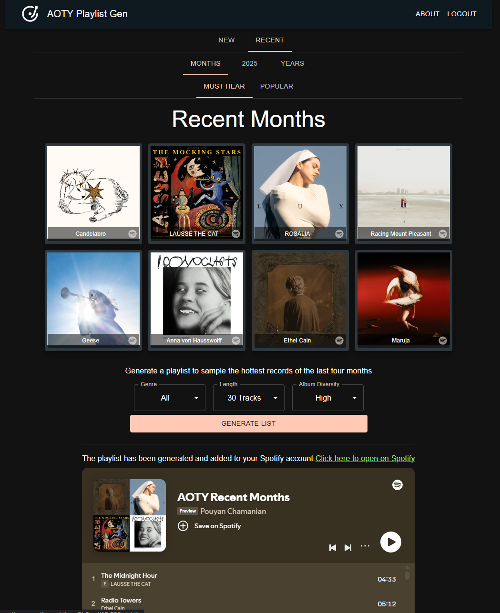

# AOTY Playlist generator (2.0)

Generate playlists compiled from the most talked about albums over at albumoftheyear.org. Useful for when you want a glimpse of the hottest or newest albums without having to spend time manually browsing music blogs and forums. Great for discovering you next favourite artist or album.

### How it works:

Access the app here: https://aotygen-backend-577807993427.northamerica-northeast2.run.app/

**Important note**: The current version requires your Spotify account to be whitelisted in order to log in and add playlists directly to your account. Otherwise, use the guest login and save the generated playlists to keep them!

#### Features:

Navigate the tabs and menus to get the desired filter of release period, genre, and playlist length. A dynamic preview of albums is shown, and clicking on an album cover will open it up on Spotify. Click generate playlist, wait for it to load, open it on Spotify and save it to your library.

### Version details:

2.0 involves switching the backend from node.js to Go to utilize preformance optimizations from a compiled language as well as go routines (concurrency). Caching and containerization has also been implemented for better performance and ease of deployment.

Code for scraping functionality has been moved to a separate repo to resolve reliability issues: https://github.com/pouyannc/aoty_gen_scrape
